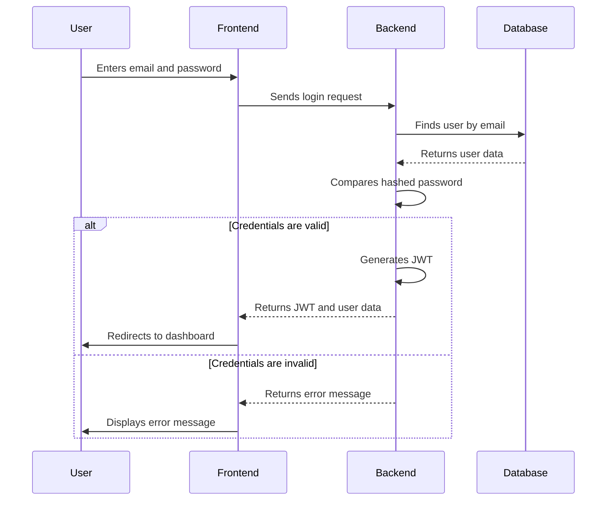
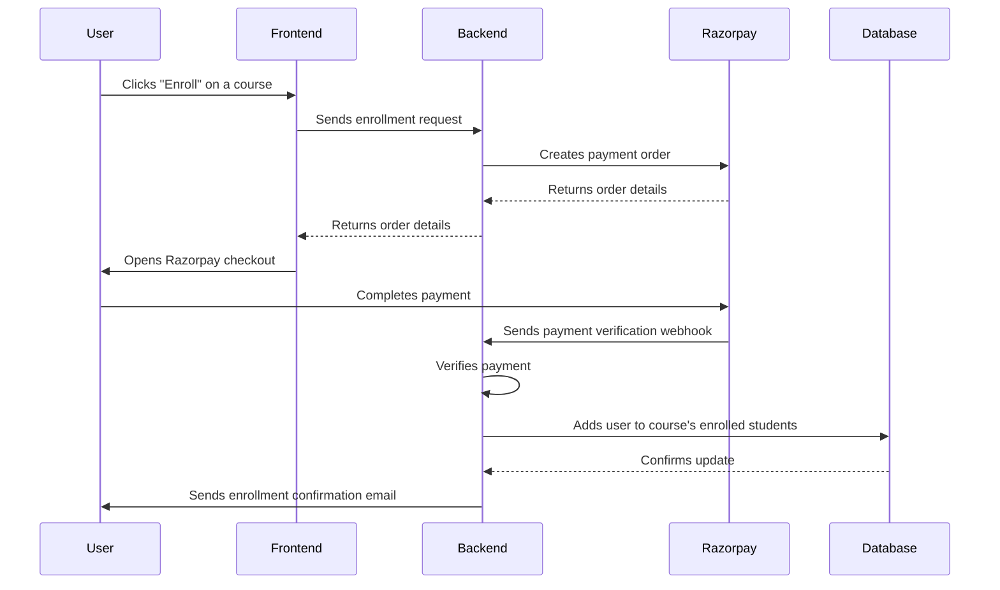

# System Design Document (SDD)

## 1. Introduction

This document provides a detailed description of the system design for the ClzMate MVP. It covers the system architecture, components, data flow, and module interactions.

## 2. System Architecture

The ClzMate application follows a client-server architecture. The system is composed of two main components:

-   **Frontend**: A single-page application (SPA) built with React and Vite. It is responsible for the user interface and user experience.
-   **Backend**: A RESTful API built with Node.js and Express.js. It handles the business logic, data processing, and communication with the database.

The architecture is designed to be scalable and maintainable, with a clear separation of concerns between the frontend and backend.

## 3. System Components

### 3.1 Frontend

-   **Framework**: React with Vite
-   **State Management**: Redux
-   **Styling**: Tailwind CSS
-   **Key Libraries**:
    -   `axios`: For making HTTP requests to the backend API.
    -   `react-router-dom`: For routing and navigation.
    -   `react-hook-form`: For managing forms.

### 3.2 Backend

-   **Framework**: Node.js with Express.js
-   **Database**: MongoDB with Mongoose ODM
-   **Authentication**: JSON Web Tokens (JWT)
-   **Key Libraries**:
    -   `bcrypt`: for password hashing.
    -   `jsonwebtoken`: for creating and verifying JWTs.
    -   `mongoose`: for interacting with the MongoDB database.
    -   `cloudinary`: for file uploads.
    -   `razorpay`: for payment processing.

### 3.3 Database

-   **Type**: NoSQL (MongoDB)
-   **Schema**: The database schema is defined using Mongoose models. The key models include `User`, `Course`, `Classroom`, `Assignment`, `Quiz`, and `Submission`.

### 3.4 External Services

-   **Cloudinary**: Used for storing and managing file uploads, such as course thumbnails and user profile pictures.
-   **Razorpay**: Used for processing payments for course enrollments.

## 4. Data Flow

### 4.1 User Authentication

### 4.2 Course Enrollment

## 5. Module Interactions

### 5.1 Frontend-Backend Communication

The frontend and backend communicate via a RESTful API. The frontend sends HTTP requests (GET, POST, PUT, DELETE) to the backend to fetch data, create new resources, update existing resources, and delete resources. The backend responds with JSON data.

### 5.2 Backend-Database Communication

The backend uses the Mongoose library to interact with the MongoDB database. Mongoose provides a straightforward, schema-based solution to model application data. It includes built-in type casting, validation, query building, and business logic hooks.

## 6. Design Patterns

### 6.1 Model-View-Controller (MVC)

The backend follows a structure similar to the MVC pattern:

-   **Models**: The Mongoose schemas in `backend/src/models` define the structure of the data.
-   **Views**: The frontend components and pages serve as the views.
-   **Controllers**: The Express controllers in `backend/src/controllers` handle the business logic and interactions between the models and views.

### 6.2 Redux

The frontend uses the Redux pattern for state management. This provides a centralized store for all the application's state, making it easier to manage and debug.
