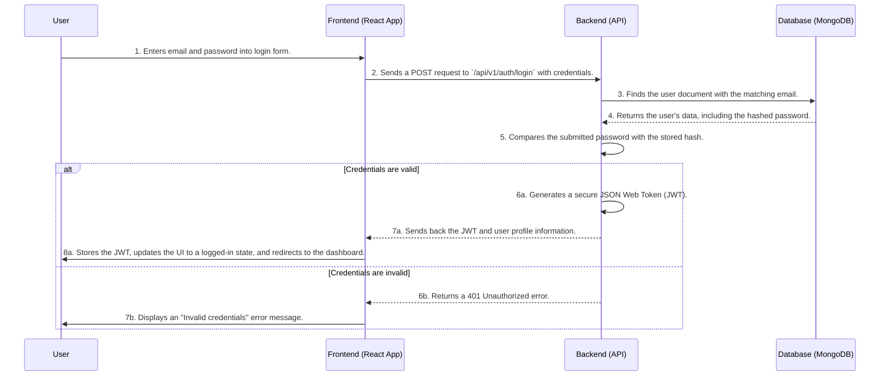
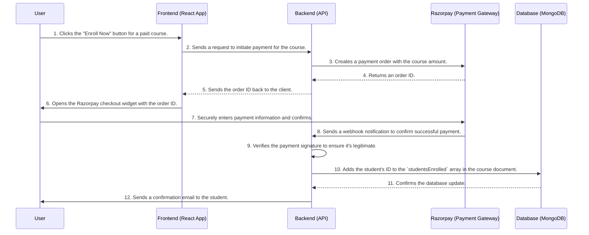

# System Design Document (SDD) for ClzMate

## 1. Introduction

### 1.1 Purpose

This document provides a high-level overview of the system design for the ClzMate platform. It details the architectural choices, system components, data flows, and design patterns that form the technical foundation of the application. This document is intended for developers, architects, and technical managers to understand how the system is structured and how its different parts interact.

### 1.2 System Overview

ClzMate is a web-based application that follows a modern **client-server architecture**. This means the application is split into two primary, independent parts:

1.  **The Client (Frontend)**: This is what users see and interact with in their web browser. It's a dynamic, responsive user interface.
2.  **The Server (Backend)**: This is the engine of the application. It runs on a remote server, manages all the data and business logic, and responds to requests from the client.

This separation allows for independent development and scaling, meaning the user interface can be updated without affecting the core business logic, and vice-versa.

## 2. System Architecture & Components

### 2.1 The Frontend (Client)

The frontend is a **Single-Page Application (SPA)**. This means that instead of loading a completely new page every time a user clicks a link, the application dynamically rewrites the current page with new data from the server. This results in a faster, more fluid user experience, similar to a desktop application.

-   **Framework**: Built using **React** and **Vite**.
    -   **React** is a library for building user interfaces with reusable components, making the code organized and efficient.
    -   **Vite** is a modern build tool that provides an extremely fast development server and optimizes the code for production.
-   **State Management**: Managed by **Redux**.
    -   Redux provides a central "store" for all the application's data (like the logged-in user's information). This makes the data flow predictable and easier to debug.
-   **Communication**: Uses **Axios** to send HTTP requests to the backend API, for actions like fetching course data or submitting a login form.
-   **Routing**: Uses **react-router-dom** to handle navigation within the SPA, allowing users to move between different views (e.g., from the dashboard to a course page) without full page reloads.

### 2.2 The Backend (Server)

The backend is a **RESTful API**. This is an architectural style for designing networked applications, where the client and server communicate using standard HTTP methods (GET, POST, PUT, DELETE) over a set of defined endpoints.

-   **Framework**: Built on **Node.js** with the **Express.js** framework.
    -   **Node.js** allows us to run JavaScript on the server, enabling a unified language across the stack.
    -   **Express.js** provides a lightweight but powerful set of tools for building the API, handling requests, and managing routes.
-   **Authentication**: User identity is managed using **JSON Web Tokens (JWT)**. After a user logs in, the server issues a signed token. The client then includes this token in the header of subsequent requests to prove that the user is authenticated. This is a stateless method, which is excellent for scalability.
-   **Database Interaction**: Uses **Mongoose** as an Object Data Modeling (ODM) library to connect to and interact with the MongoDB database. Mongoose allows us to define data schemas in code, which helps enforce data consistency.

### 2.3 The Database

-   **Technology**: **MongoDB**, a NoSQL database.
    -   Unlike traditional SQL databases that use tables and rows, MongoDB stores data in flexible, JSON-like documents. This makes it easy to store complex, hierarchical data (like a course with its sections and subsections) and allows the data structure to evolve over time without difficult migrations.

### 2.4 External Services

-   **Cloudinary**: A cloud-based service for image and video management. When an instructor uploads a course thumbnail or a student uploads a profile picture, the file is sent directly to Cloudinary, which handles the storage and delivery. Our backend simply stores the URL provided by Cloudinary. This offloads the burden of file storage from our server.
-   **Razorpay**: A secure, third-party payment gateway. When a student purchases a course, the frontend application communicates with Razorpay to handle the transaction securely. Our backend is only involved in initiating the payment and verifying its success, without ever handling sensitive credit card information directly.

## 3. Data Flow Diagrams

### 3.1 User Authentication Flow (Login)

This diagram shows the step-by-step process when a user logs in.

### 3.2 Paid Course Enrollment Flow

This diagram illustrates how a student enrolls in a paid course.

## 4. Design Patterns

-   **Model-View-Controller (MVC) on the Backend**: The backend code is structured to separate concerns:
    -   **Models**: The Mongoose schemas (`/models`) define the data structure.
    -   **Views**: The React frontend acts as the view layer, which is decoupled from the backend.
    -   **Controllers**: The Express route handlers (`/controllers`) contain the application logic, processing requests and interacting with the models.
-   **Centralized State Management on the Frontend**: The frontend uses **Redux**, which implements a pattern similar to Flux. It ensures that data flows in one direction, making the application state predictable and easier to manage as the application grows in complexity.